## Final Project: Ujian Akhir Semester

```bash
Kelompok 6      : - Fadli Ramadhan      (312110538)
                  - Irfan Fadlurrahman  (312110465)
                  - Alvina Damayanti    (312110125)
                  - Arjun Syah          (312110102)
                  - Denis Alviansyah    (312110427)
                  - Maftuhin Amanullah  (312110610)
Tema Project   : Database Penyewaan Penginapan Villa
Kelas           : TI. 21. A3
Mata Kuliah     : Pemrograman Web 2
Dosen Pengampu  : Agung Nugroho,S.Kom.,M.Kom
```

## Demo Aplikasi dan Domain

1. Demo aplikasi pada link youtube:

  https://youtu.be/6p45o5LbH2E

2. Domain aplikasi, berikut ini:

## Logo Aplikasi Penyewaan Penginapan Villa


## Fitur

- Daftar villa-villa mewah yang tersedia dengan deskripsi singkat.
- Informasi harga dan ketersediaan villa-villa.
- Galeri foto-foto villa.
- Fasilitas dan layanan yang ditawarkan.
- Proses pemesanan yang mudah dan aman.
- Informasi kontak untuk pertanyaan atau dukungan.

## Cara Menggunakan

1. Buka [situs web penyewaan villa](http://www.penyewaanvilla.com).
2. Telusuri daftar villa yang tersedia untuk menemukan villa yang diinginkan.
3. Baca deskripsi villa, melihat galeri foto, dan memeriksa fasilitas yang ditawarkan.
4. Periksa ketersediaan villa dengan memilih tanggal check-in dan check-out yang diinginkan.
5. Jika villa tersedia, isi formulir pemesanan dengan rincian kontak dan informasi tambahan yang diperlukan.
6. Konfirmasi pemesanan dan lakukan pembayaran sesuai instruksi yang diberikan.
7. Anda akan menerima konfirmasi pemesanan melalui email dengan rincian pemesanan Anda.

## Kontak

Jika Anda memiliki pertanyaan atau membutuhkan dukungan tambahan, silakan hubungi kami melalui:

- Email: info@penyewaanvilla.com
- Telepon: +62-123-456789
- Alamat: Jalan Villa Indah No. 123, Kota Semarak, Indonesia

Kami dengan senang hati akan membantu Anda dengan pertanyaan atau permintaan Anda secepat mungkin.

## Tampilan Aplikasi Penyewaan Penginapan Villa dari sisi Client

1. Tampilan Home

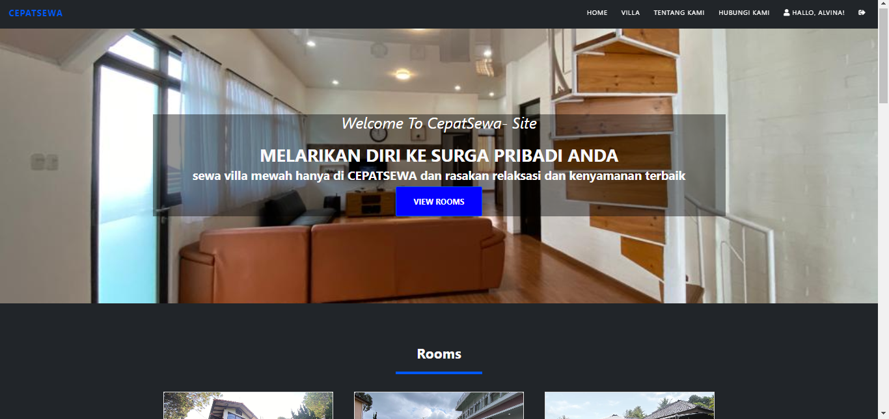

2. Tampilan Room List Villa

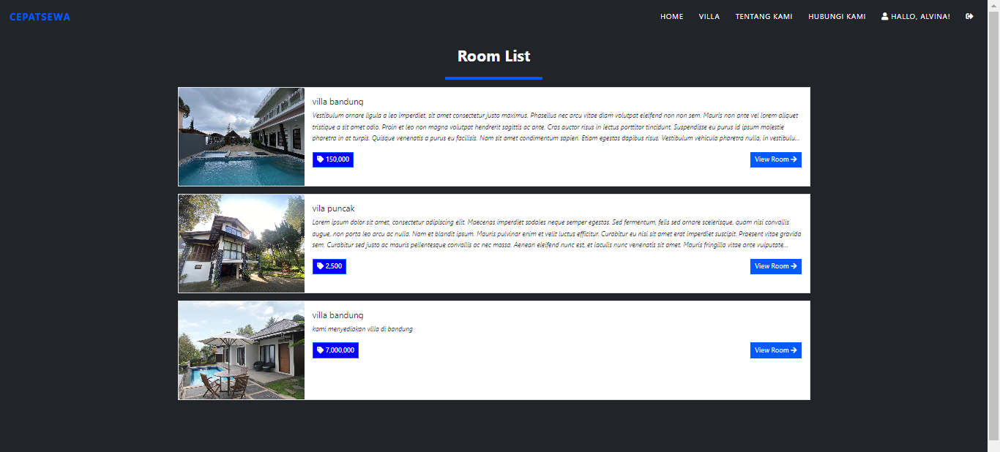

3. Tampilan View Room

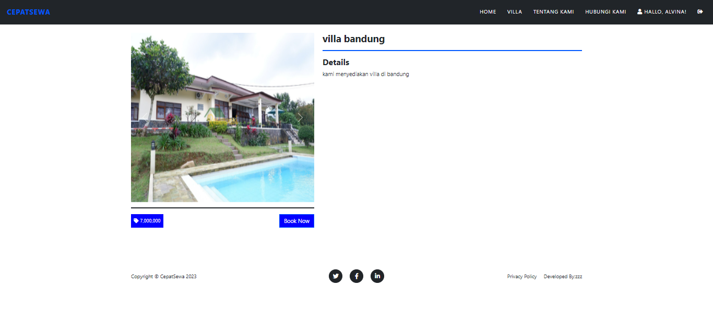

4. Tampilan Booking Villa untuk client

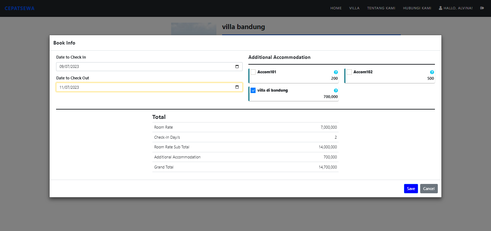

6. Tampilan setelah client melakukan pembookingan villa

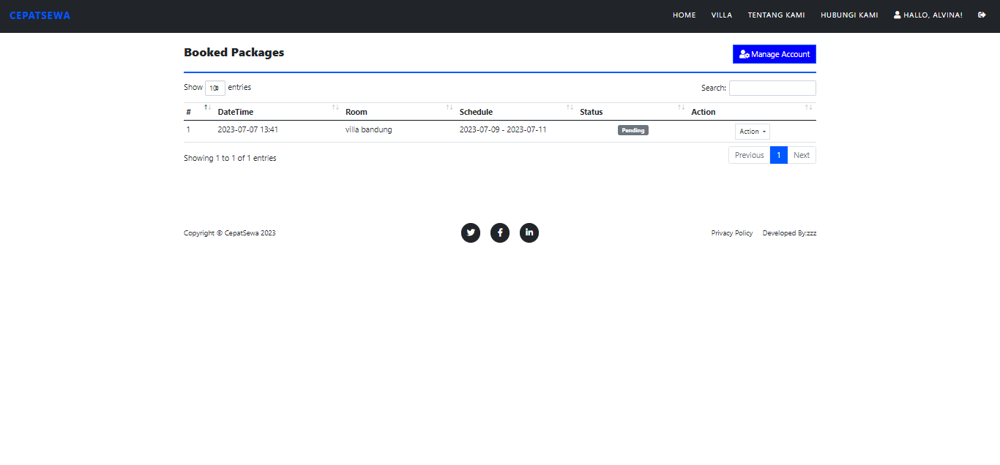

7. Tampilan Manage Account Client

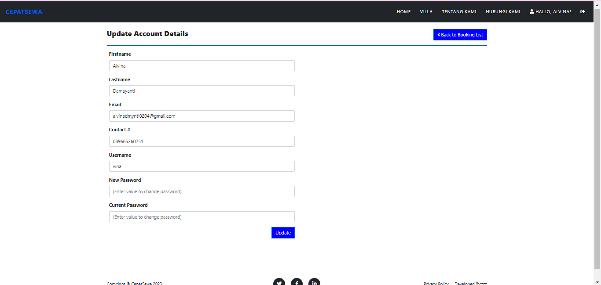

8. Tampilan About (Tentang Kami)

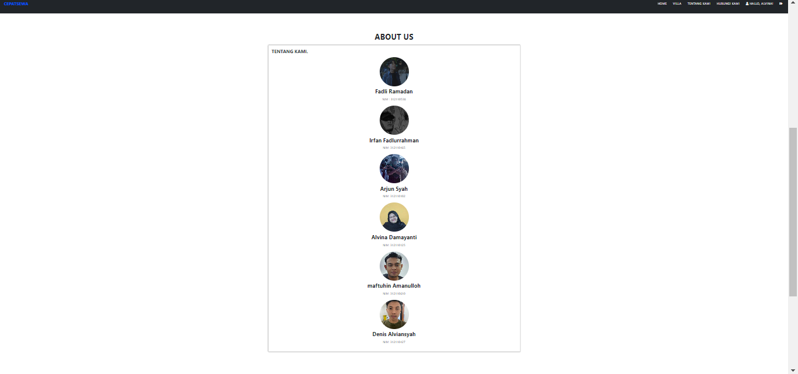

9. Tampilan Contact Us Client untuk menghubungi pihak pengelola villa

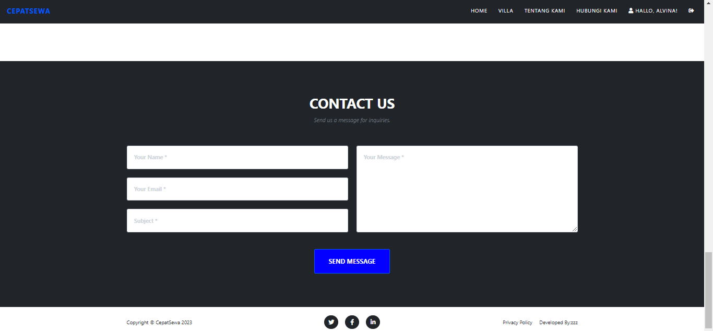

## Tampilan Aplikasi Penyewaan Penginapan Villa dari sisi Admin

> Untuk Admin bisa masuk pada Aplikasi Penyewaan Villa ini Admin harus Login dengan menggunakan Username 'admin' dan Password 'admin123'

1. Tampilan Login untuk Admin

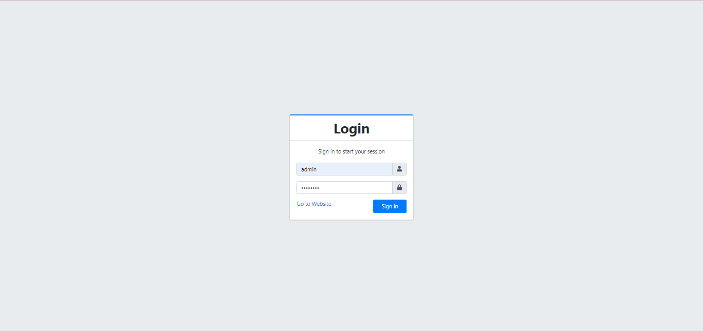

2. Tampilan Home Admin

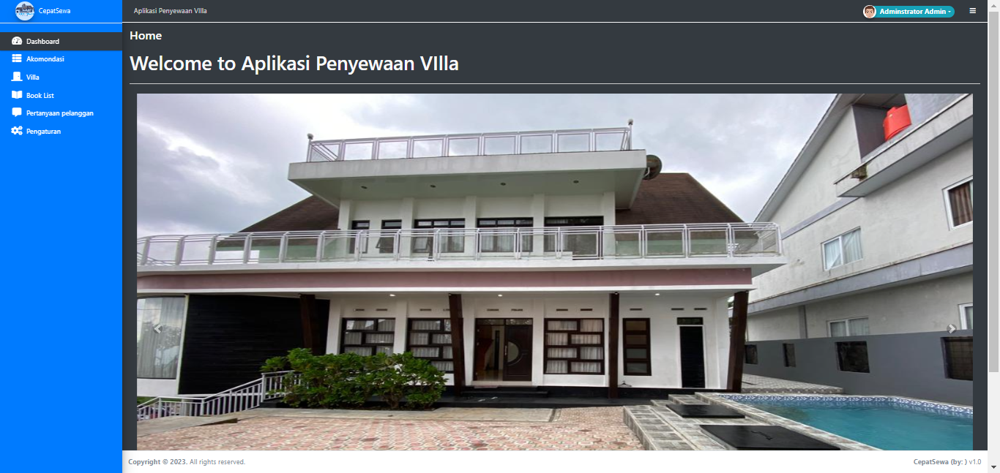

3. Tampilan Akomodasi

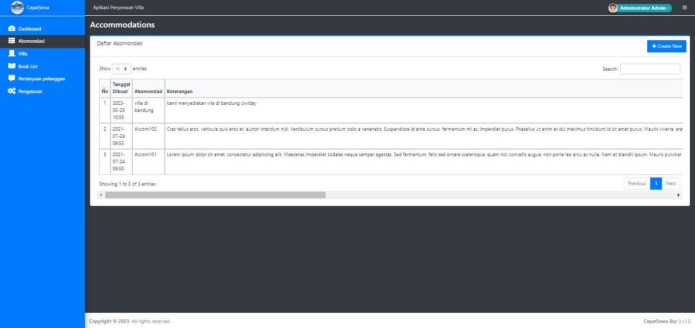

4. Tampilan Room Villa yang tersedia

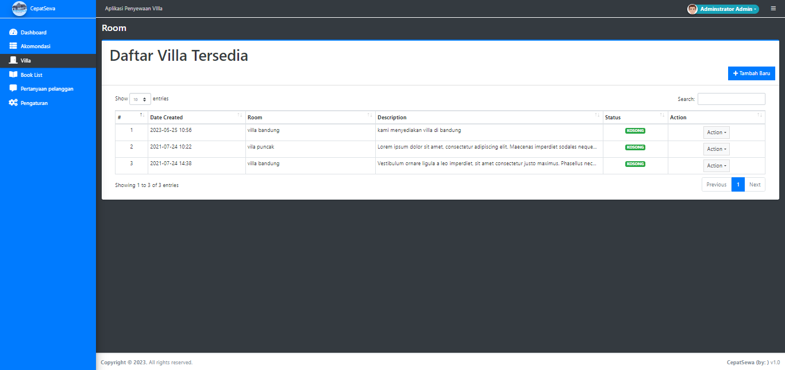

5. Tampilan Booking List villa pada Admin

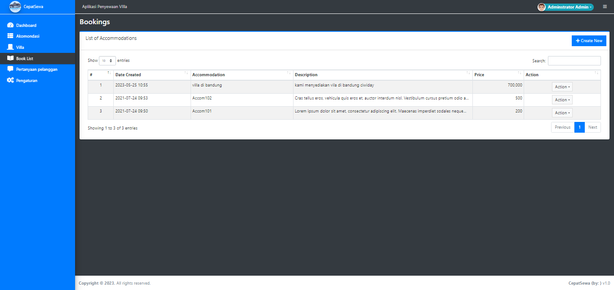

6. Tampilan Pertanyaan Pelanggan pada Admin

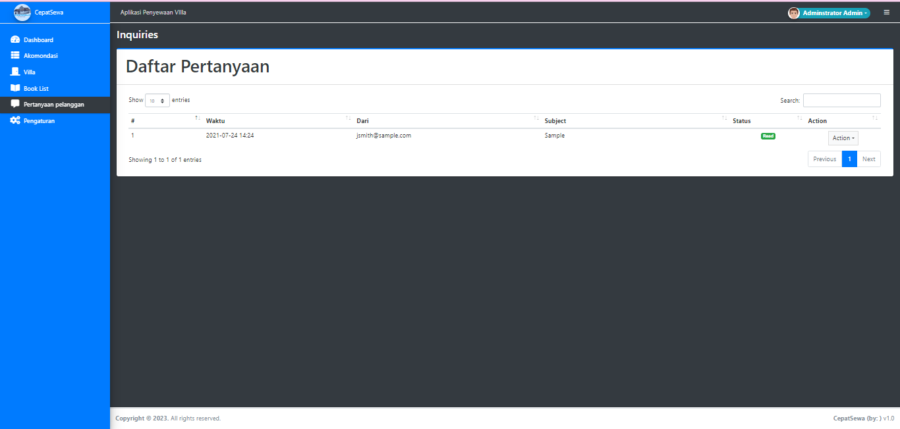

7. Tampilan Pengaturan pada Admin

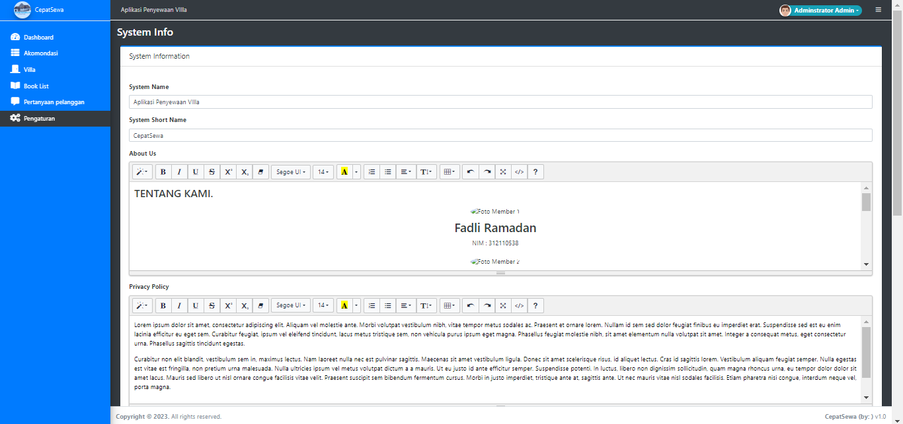

## Catatan

Pastikan Anda membaca syarat dan ketentuan pemesanan sebelum melakukan pemesanan. Harap dicatat bahwa pemesanan villa dapat tunduk pada kebijakan pembatalan tertentu, dan pembayaran mungkin diperlukan untuk mengonfirmasi pemesanan Anda. Silakan merujuk ke [situs web penyewaan villa](http://www.penyewaanvilla.com) untuk informasi lebih lanjut.

Terima Kasih